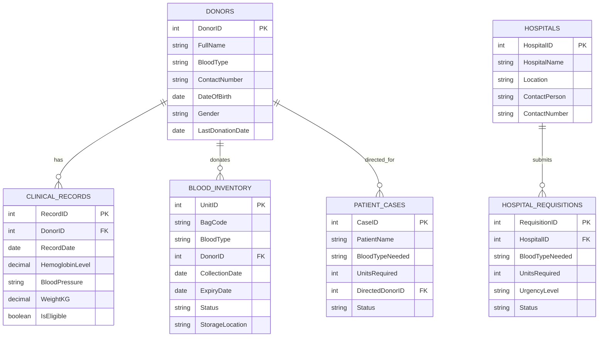

# BloodLink — Conceptual ER Diagram

**Author:** Mahmudul Hasan Mehdi (251-115-028)  
**Date:** 26 September 2026  
**Status:** Draft

---

## 1. Entities

### Hospitals

External hospitals that submit blood requisitions.

| Column        | Type         | Notes       |
| ------------- | ------------ | ----------- |
| HospitalID    | INT          | Primary Key |
| HospitalName  | VARCHAR(150) |             |
| Location      | VARCHAR(255) |             |
| ContactPerson | VARCHAR(100) |             |
| ContactNumber | VARCHAR(20)  |             |
| CreatedAt     | TIMESTAMP    | Default now |

---

### Donors

Individuals who donate blood. Clinical eligibility is checked at intake
(120-day recovery rule) before a new donation is accepted.

| Column           | Type                                            | Notes                 |
| ---------------- | ----------------------------------------------- | --------------------- |
| DonorID          | INT                                             | Primary Key           |
| FullName         | VARCHAR(100)                                    |                       |
| BloodType        | ENUM('A+','A-','B+','B-','AB+','AB-','O+','O-') |                       |
| ContactNumber    | VARCHAR(20)                                     | Unique                |
| DateOfBirth      | DATE                                            |                       |
| Gender           | ENUM('Male','Female','Other')                   |                       |
| LastDonationDate | DATE                                            | NULL if never donated |
| CreatedAt        | TIMESTAMP                                       | Default now           |

---

### Clinical_Records

Medical prerequisite measurements recorded at each donor intake. One donor
can have many clinical records (one per visit). The backend reads the most
recent record to validate eligibility.

| Column          | Type         | Notes                         |
| --------------- | ------------ | ----------------------------- |
| RecordID        | INT          | Primary Key                   |
| DonorID         | INT          | Foreign Key → Donors(DonorID) |
| RecordDate      | DATE         | Date of the check-up          |
| HemoglobinLevel | DECIMAL(4,1) | g/dL; typical range 12.0–18.0 |
| BloodPressure   | VARCHAR(10)  | e.g. '120/80'                 |
| WeightKG        | DECIMAL(5,2) | kg                            |
| IsEligible      | BOOLEAN      | Computed at intake            |
| CreatedAt       | TIMESTAMP    | Default now                   |

---

### Blood_Inventory

Individual physical blood bags stored in the central hub. Each bag is
tracked from intake to dispatch or discard. This is the table that powers
the 42-day expiry engine and the FIFO dispatch algorithm.

| Column          | Type                                            | Notes                                          |
| --------------- | ----------------------------------------------- | ---------------------------------------------- |
| UnitID          | INT                                             | Primary Key                                    |
| BagCode         | VARCHAR(30)                                     | Simulated barcode, Unique                      |
| BloodType       | ENUM('A+','A-','B+','B-','AB+','AB-','O+','O-') |                                                |
| DonorID         | INT                                             | Foreign Key → Donors(DonorID); NULL if unknown |
| CollectionDate  | DATE                                            | Date bag was collected                         |
| ExpiryDate      | DATE                                            | CollectionDate + 42 days (auto)                |
| Status          | ENUM('Active','Dispatched','Discarded')         | Soft-delete flag                               |
| StorageLocation | VARCHAR(50)                                     | e.g. 'Fridge A - Shelf 2'                      |
| CreatedAt       | TIMESTAMP                                       | Default now                                    |

---

### Patient_Cases

Specific patient blood requirements logged by the central hub. Supports the
"Directed Donation" rule: a case may name a specific donor whose bag must be
reserved for that patient.

| Column          | Type                                            | Notes                                                |
| --------------- | ----------------------------------------------- | ---------------------------------------------------- |
| CaseID          | INT                                             | Primary Key                                          |
| PatientName     | VARCHAR(100)                                    |                                                      |
| BloodTypeNeeded | ENUM('A+','A-','B+','B-','AB+','AB-','O+','O-') |                                                      |
| UnitsRequired   | INT                                             | CHECK (UnitsRequired > 0)                            |
| DirectedDonorID | INT                                             | Foreign Key → Donors(DonorID); NULL for normal cases |
| Status          | ENUM('Open','Fulfilled','Cancelled')            |                                                      |
| OpenedAt        | TIMESTAMP                                       | Default now                                          |

---

### Hospital_Requisitions

Emergency blood requests submitted by external hospitals. Each requisition
references one hospital and requests a specific blood type and quantity.

| Column          | Type                                              | Notes                               |
| --------------- | ------------------------------------------------- | ----------------------------------- |
| RequisitionID   | INT                                               | Primary Key                         |
| HospitalID      | INT                                               | Foreign Key → Hospitals(HospitalID) |
| BloodTypeNeeded | ENUM('A+','A-','B+','B-','AB+','AB-','O+','O-')   |                                     |
| UnitsRequired   | INT                                               | CHECK (UnitsRequired > 0)           |
| UrgencyLevel    | ENUM('Standard','Urgent','Critical')              | Default 'Standard'                  |
| Status          | ENUM('Pending','Approved','Fulfilled','Rejected') | Default 'Pending'                   |
| RequestedAt     | TIMESTAMP                                         | Default now                         |

---

## 2. Relationships

The tables connect through the following foreign-key relationships:

| From      | Cardinality | To                    | Meaning                                                        |
| --------- | ----------- | --------------------- | -------------------------------------------------------------- |
| Donors    | 1 : N       | Clinical_Records      | One donor can have many clinical check-up records              |
| Donors    | 1 : N       | Blood_Inventory       | One donor can donate multiple blood bags over time             |
| Donors    | 1 : N       | Patient_Cases         | One donor may be the directed donor for multiple patient cases |
| Hospitals | 1 : N       | Hospital_Requisitions | One hospital can submit many requisitions                      |

---

## 3. Mermaid ER Diagram

